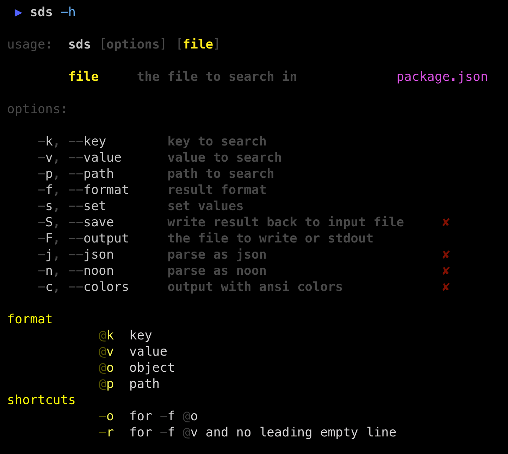
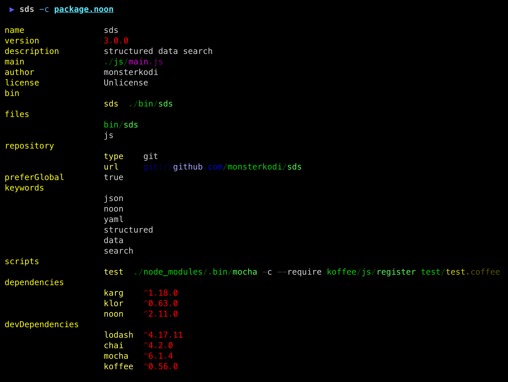
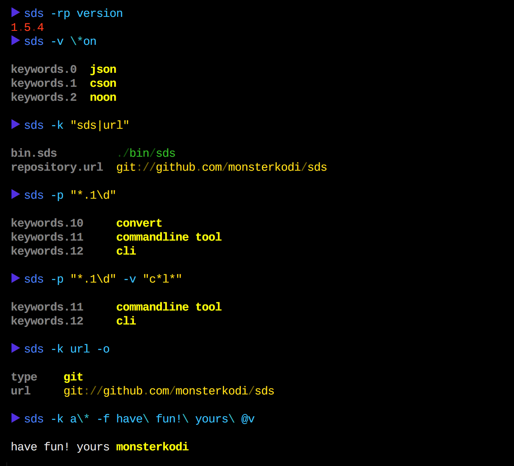

### list



### search



### suche die struktur

```coffeescript
sds = require 'sds'

# test against sds.extnames [list of supported file extensions]

if path.extname(infile) in sds.extnames

    # load object from file
    
    obj = sds.load infile

    # find something ...
    
    sds.find.value     obj, '*value' 
    sds.find.key       obj, '*key' 
    sds.find.path      obj, '*path' 
    sds.find.keyValue  obj, '*key',  '*value'
    sds.find.pathValue obj, '*path', '*value'
    
    # all find methods return a list of keypaths
    # each keypath is in itself a list of strings
    #
    # use sds.get to retrieve the value at a keypath
    
    sds.get obj, keypath

    # use stringify to convert to any of the supported formats
    
    sds.stringify obj, ext: 'yaml'
    
    # or save to disk (format is deduced from extension)
    
    sds.save outfile, obj
    
    # happy searching :-)
```

[![npm package][npm-image]][npm-url] 
[![Build Status][travis-image]][travis-url] 
[![downloads][downloads-image]][downloads-url] 
[![Dependencies Status][david-image]][david-url]

[npm-image]:https://img.shields.io/npm/v/sds.svg
[npm-url]:http://npmjs.org/package/sds
[travis-image]:https://travis-ci.org/monsterkodi/sds.svg?branch=master
[travis-url]:https://travis-ci.org/monsterkodi/sds
[david-image]:https://david-dm.org/monsterkodi/sds/status.svg
[david-url]:https://david-dm.org/monsterkodi/sds
[downloads-image]:https://img.shields.io/npm/dm/sds.svg
[downloads-url]:https://www.npmtrends.com/sds


